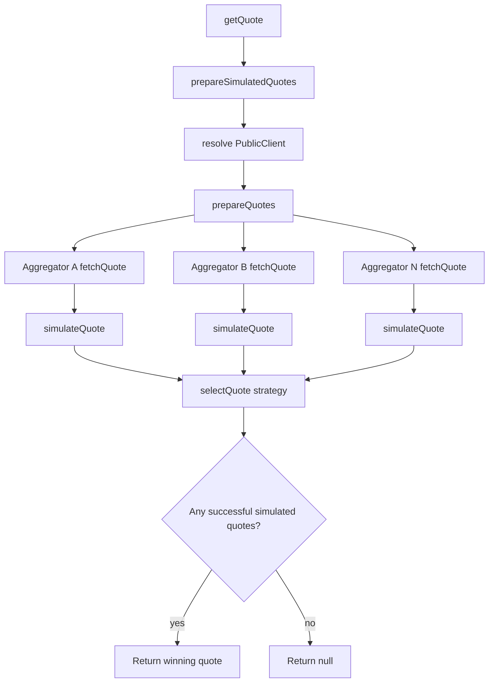
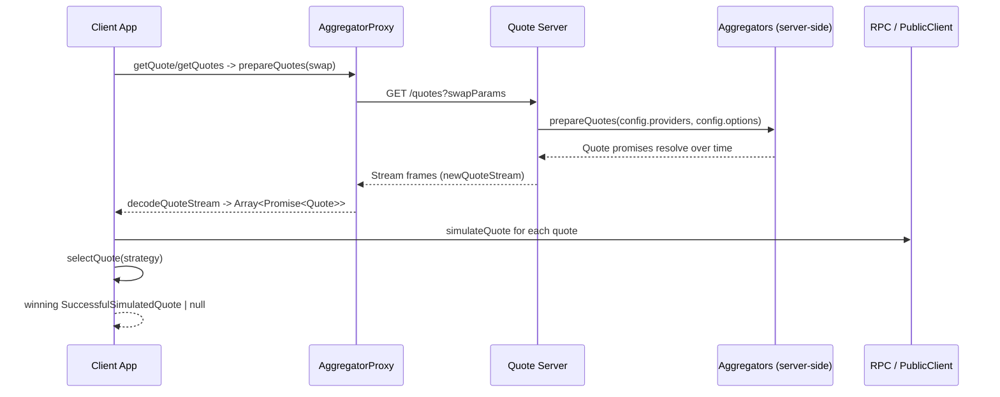

# spanDEX Core Architecture

This document explains how `@spandex/core` is structured and how the main quote pipeline fits
together.

## What Core Does

At a high level, core is a quote orchestration engine:

1. Fetch quotes from one or more aggregators.
2. Simulate each quote onchain.
3. Filter and rank successful simulations.
4. Return one winner (or all results), and optionally execute it.

The primary implementation lives in `packages/core/lib/`.

## Core Function Map

| Function | Purpose |
|---|---|
| `createConfig` | Build runtime config for either direct providers or proxy mode. |
| `getRawQuotes` | Fetch provider quotes only (no simulation). |
| `getQuotes` | Fetch + simulate all quotes; return all simulated results. |
| `getQuote` | Fetch + simulate + select one winning quote. |
| `prepareQuotes` | Low-level quote promise builder (parallel provider fetch pipeline). |
| `prepareSimulatedQuotes` | `prepareQuotes` + simulation mapping for each quote. |
| `simulateQuote` / `simulateQuotes` | Run `simulateCalls` and attach simulation metadata. |
| `selectQuote` | Apply selection strategy (`fastest`, `bestPrice`, `estimatedGas`, `priority`, custom). |
| `executeQuote` | Execute a successful simulated quote (approval + swap, batch if supported). |
| `newQuoteStream` / `decodeQuoteStream` | Stream quote results over the wire for proxy/server setups. |

## End-to-End Flow (`getQuote`)

`getQuote` is the main orchestration function:

1. `getQuote` calls `prepareSimulatedQuotes`.
2. `prepareSimulatedQuotes` resolves a `PublicClient` (passed in or via config by `chainId`).
3. It calls `prepareQuotes` with a `mapFn` that runs `simulateQuote` for each quote.
4. `prepareQuotes` starts provider quote fetching in parallel.
5. Each resolved quote is simulated and decorated with simulation/performance metadata.
6. `selectQuote` applies strategy logic:
   - `fastest`: first successful simulated quote (`Promise.any`).
   - `bestPrice`: waits for all, keeps successful simulations, chooses highest simulated output.
   - `estimatedGas`: waits for all, keeps successful simulations, chooses lowest simulated gas.
   - `priority`: waits for all, ranks by activated feature priority, then simulated output.
7. Returns `SuccessfulSimulatedQuote | null`.

Notes:
- Failed quote fetches and failed simulations remain in the pipeline as failures.
- Selection filters to quotes where both `quote.success` and `simulation.success` are true.
- For non-`fastest` strategies, results are gathered first, then filtered/ranked.

### Direct Providers Diagram

## Quote Fetching Details (`prepareQuotes`)

`prepareQuotes` is the central branching point:

- Direct mode (`config.providers`):
  - Computes required features from swap mode (`exactIn` or `targetOut`).
  - Filters providers that support required features.
  - Calls each provider `fetchQuote` in parallel.
  - Annotates activated fee/surplus features for downstream ranking.
- Proxy mode (`config.proxy`):
  - Delegates to `config.proxy.prepareQuotes(...)`.
  - Receives a streamed list of quote promises from a server endpoint.

Provider adapters inherit from `Aggregator` (`packages/core/lib/aggregators/index.ts`), which
adds retry, backoff, deadline, and latency measurement around each provider-specific
`tryFetchQuote`.

## Simulation Details (`simulateQuote`)

Simulation runs after each quote is fetched:

- Failed quotes are converted to failed simulations (`Cannot simulate failed quote`).
- Successful quotes are simulated with `simulateCalls`.
- Calls include swap calldata, plus approval/balance checks when ERC20 handling is needed.
- Failures are wrapped (including low-level revert details).
- Successful output includes:
  - `simulation.outputAmount`
  - `simulation.gasUsed`
  - `simulation.blockNumber`
  - performance metrics (`latency`, `priceDelta`, `accuracy`)

This gives selection and UI layers a normalized, provider-agnostic comparison surface.

## Proxy Mode Architecture

Proxy mode separates responsibilities:

- Client app:
  - Uses `createConfig({ proxy, clients })`.
  - Sends swap params to a quote endpoint.
  - Decodes streamed quote frames.
  - Runs local simulation + selection.
- Server:
  - Uses direct provider config (`createConfig({ providers, options, ... })`).
  - Calls `prepareQuotes` against its own providers/options/retry/deadline/network setup.
  - Streams quotes with `newQuoteStream(...)`.

This is useful for browser clients where direct provider calls may be blocked by CORS, or when you
want centralized provider tuning and infrastructure control.

Important behavior in current implementation:
- In proxy config, client-side `options` are intentionally disabled.
- Server-side config controls providers and aggregation options.
- Quote transport is streaming/binary framed, so results can arrive incrementally.
- Simulation still occurs on the client after stream decode.

### Proxy Mode Sequence Diagram

## Extension Points

Common places to extend behavior:

- Add a provider:
  - Implement `Aggregator.tryFetchQuote` + metadata/features in `packages/core/lib/aggregators/`.
- Customize selection:
  - Pass a custom `QuoteSelectionFn` to `getQuote`/`selectQuote`.
- Build custom pipelines:
  - Use `prepareQuotes` directly with your own `mapFn`.
- Add server-side quote infrastructure:
  - Use `prepareQuotes` + `newQuoteStream` on the server and `proxy` + `decodeQuoteStream` on
    the client.

